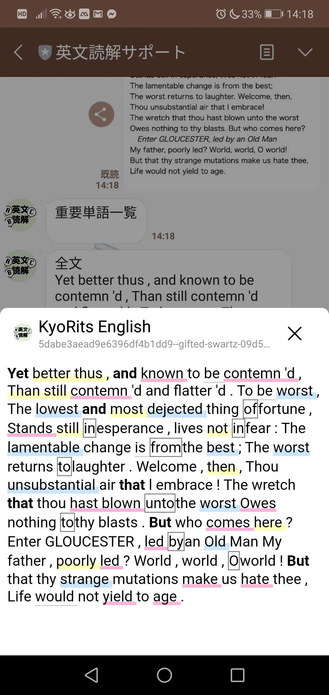
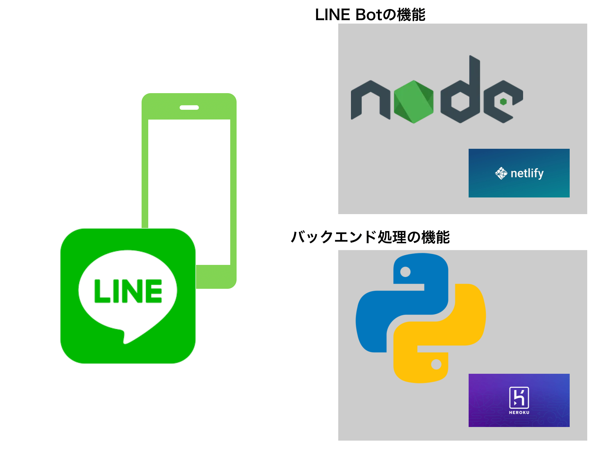

# 英文読解サポーター

## 製品概要
### 英語学習 x Tech

### 背景（製品開発のきっかけ、課題等）
- 英語は日本語とは言語レベルで大きく異なるため日本人にとって英語学習は難しい
- 小中高大と英語学習をしてもそれほど英語が好きという人はあまりいない
- より英語学習を身近かつ簡単にしたい
- 英単語がなかなか覚えられない、英文を読もうとしても難しい単語が多くて読めないなどといった、***英語とのファーストタッチでのドロップアウトを少しでも減らしたい***

といった経験から、英文章を読む際に役に立つサービスを考えました。

### 製品説明（具体的な製品の説明）
LINE上で、英語の教科書や英語で書かれた本の写真を送信することで、英文の文字起こし、構文解析、単語リストを生成する

英語とのファーストタッチを意識するため、英語を学習しようといった意思がないと導入が難しいアプリや、ブラウザへの誘導を極力避け、LINE bot上でほとんど完結する

個人単位での文章保存や、単語リストの生成、簡単な単語テスト機能(ハッカソン内では未実装)

### 特長

#### 1. 特長1
**写真を取ることで自動で文字起こしをしてくれる**

わからない単語や文章を調べる時、写真を撮るだけで文字起こしと意味が表示される

#### 2. 特長2
**構文解析**

テキストの構文解析をし、マーカーやアンダーラインを自動で生成することで、英語の文章理解をよりしやすくする

#### 3. 特長3
**重要単語、単語帳**

あらかじめ文章内の重要単語やキーポイントを表示してくれるため、よりそのポイントを意識した学習ができる

### 解決出来ること

英語とのファーストコンタクトでのドロップアウトを少しでも減らし、より本質的な英語学習を可能にする

### 今後の展望
個人単位での単語帳生成やミニテストで一人一人にあった学習を支援する

単語をタップすることによるポップアップ表示(日本語や詳細など)、発音発声の実装

単語暗記のミニテストだけではなく、発音テストも実装できる

## 開発内容・開発技術

### なぜマルチサーバーを立てたか
- LINE Botの機能独立
  - LINE botのレスポンスが返らない -> インシデント。であるため外部機能に関する部分をapiをして切り離すことでLINE bot の外部要因による機能不全を極力減らす

### 活用した技術
#### API・データ
今回スポンサーから提供されたAPI、製品などの外部技術があれば記述をして下さい。
* IBM Cloud API(構文解析)
* Google Cloud API(文章文字起こし)
* LINE messaging api
* LINE Front end Framework

#### フレームワーク・ライブラリ・モジュール
* python 
* node

#### デバイス
* スマホデバイス

### 独自開発技術（Hack Dayで開発したもの）
#### 2日間に開発した独自の機能・技術
* LINE bot作成
* LIFF実装
* 外部サービスをコンポーネントしたapi
* マルチサーバー間の通信、データ作成、受け渡し
* github上の全て
